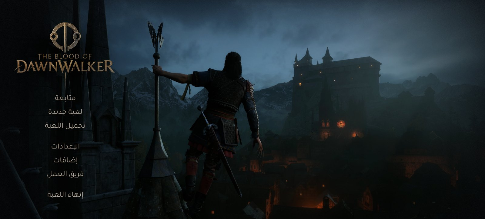
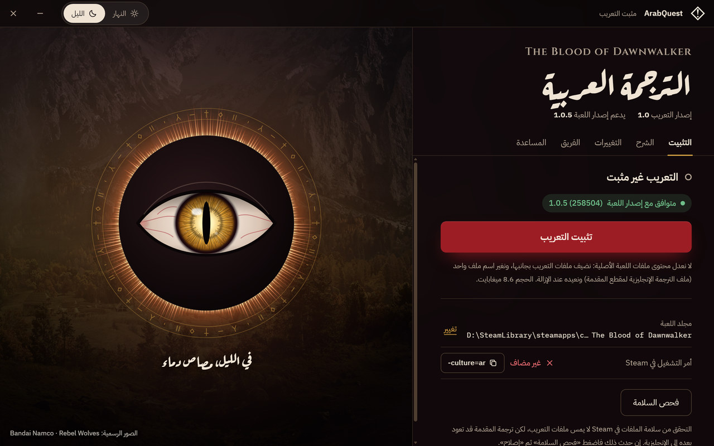
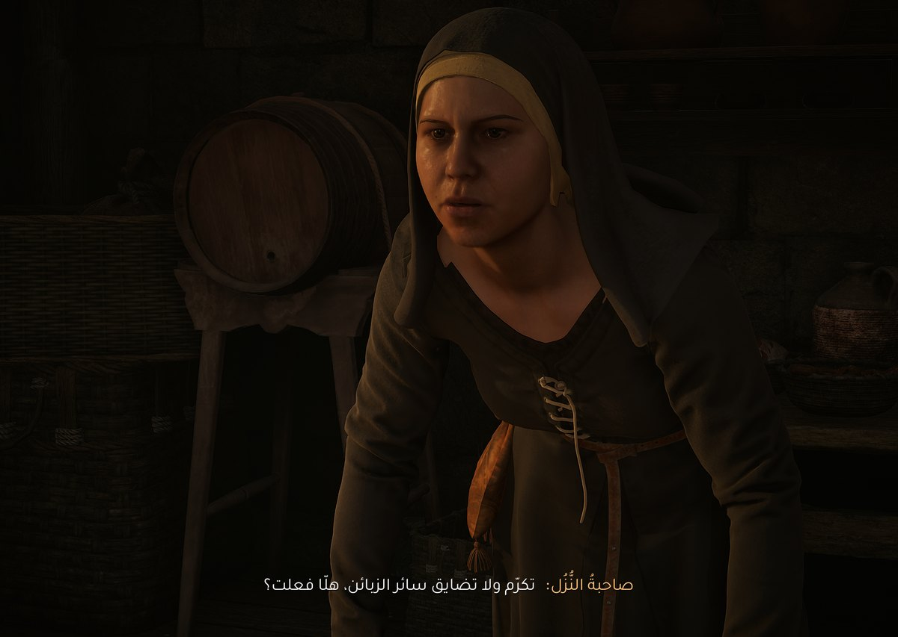
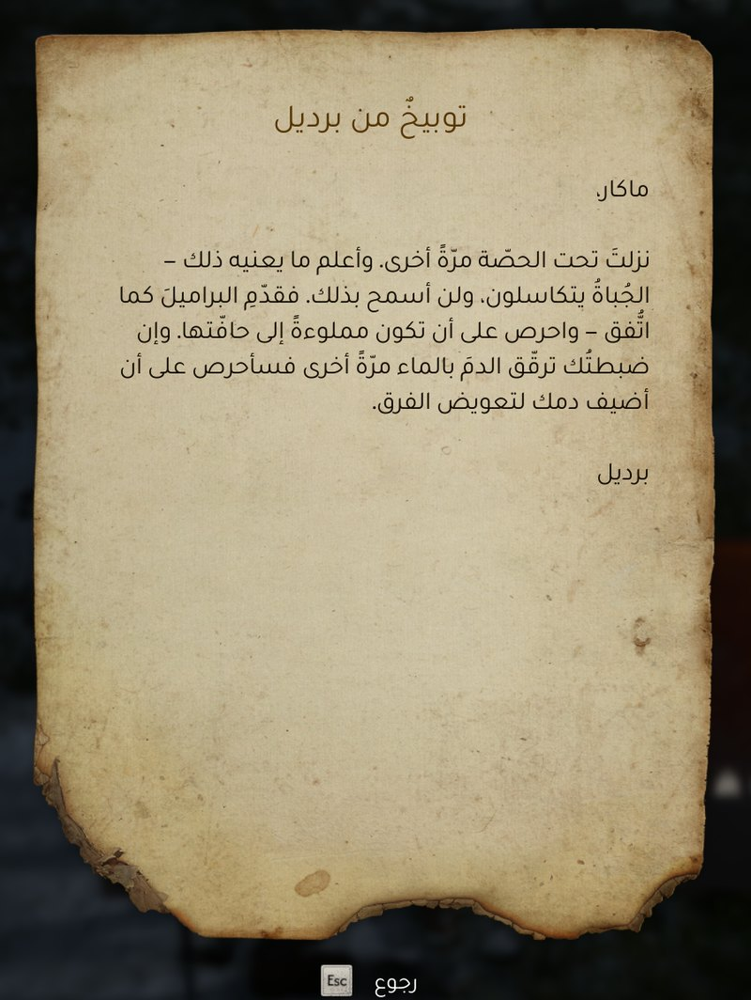
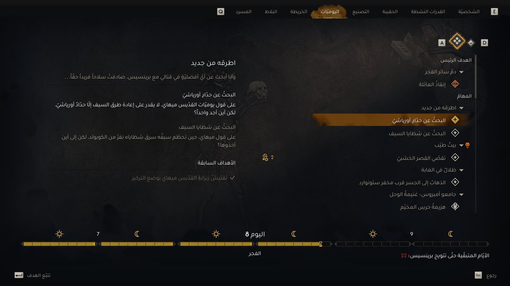
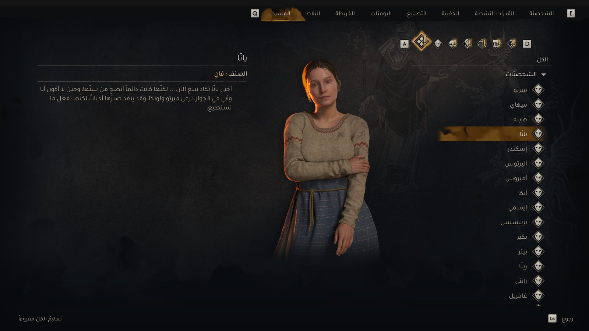
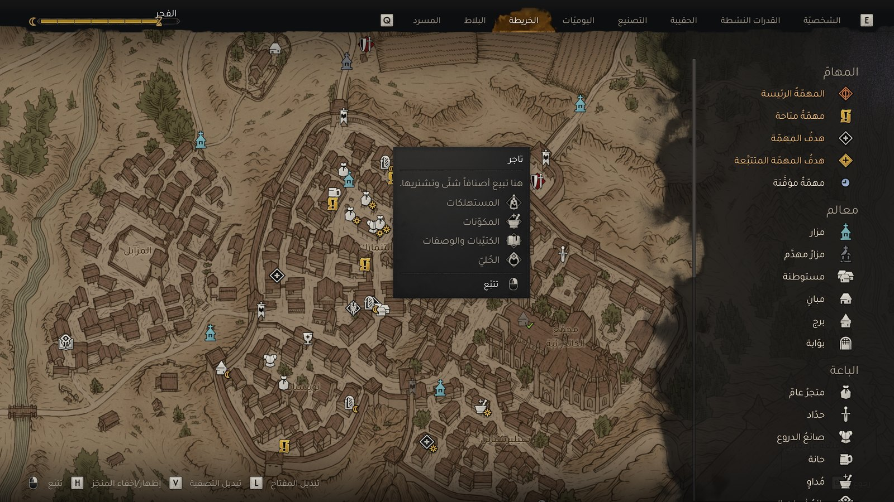
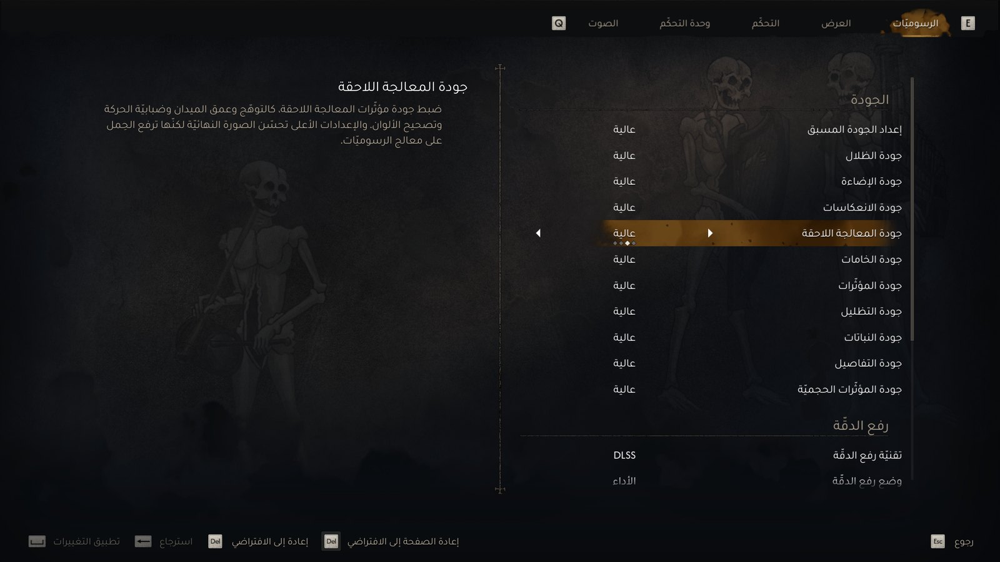
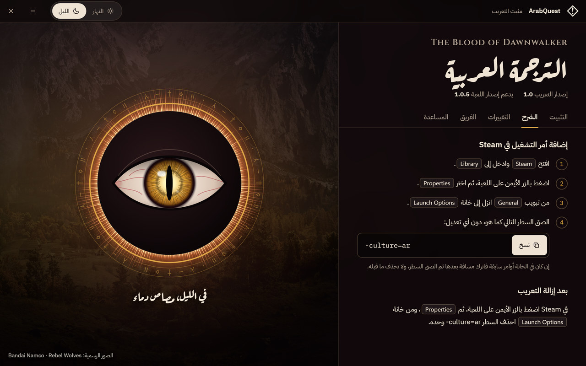

<div dir="rtl">

<p align="center">

</p>

<h1 align="center">تعريب ⁨The Blood of Dawnwalker⁩</h1>

<p align="center">
الترجمة العربية الكاملة للعبة، مع أداة تثبتها وتزيلها بضغطة واحدة.<br>
تعريب غير رسمي من فريق ⁨ArabQuest⁩ «عرب كويست».
</p>

<p align="center">
<a href="https://github.com/Seli-14/The-Blood-of-Dawnwalker-Arabic/releases/latest/download/ArabQuest-Dawnwalker.exe"></a>
</p>

<p align="center">
الإصدار 1.0 · يدعم إصدار اللعبة ⁨1.0.5⁩ على ⁨Steam⁩ · ⁨Windows 11⁩ · ملف واحد بحجم 16.8 ميغابايت
</p>

<p align="center" dir="ltr">
<sub>Unofficial Arabic translation (fan localization) for The Blood of Dawnwalker · <a href="#english">English</a></sub>
</p>

## التثبيت في أربع خطوات

1. **التنزيل:** اضغط زر «تنزيل التعريب» أعلاه. ينزل ملف واحد اسمه ⁨`ArabQuest-Dawnwalker.exe`⁩.
2. **التثبيت:** أغلق اللعبة، وافتح الملف، ثم اضغط «تثبيت التعريب». الأداة تبحث بنفسها عن لعبتك في ⁨`Steam`⁩.
3. **أمر التشغيل:** في ⁨`Steam`⁩ اضغط بالزر الأيمن على اللعبة، ثم اختر ⁨`Properties`⁩، والصق هذا السطر في خانة ⁨`Launch Options`⁩:<br>⁨`-culture=ar`⁩ ([الخطوات بالصور](#إضافة-أمر-التشغيل))
4. **اللعب:** اضغط «تشغيل اللعبة» في الأداة، أو شغلها من ⁨`Steam`⁩ كعادتك.

<p align="center">

</p>

**قد يظهر تحذير من ويندوز عند فتح الملف.** الأداة لا تحمل توقيعا رقميا، فقد يظهر تحذير من ⁨`Windows SmartScreen`⁩ أو من برنامج الحماية. احرص على تنزيلها من هذه الصفحة فقط، وتستطيع [التأكد من الملف](#أسئلة-وحلول) قبل فتحه.

إن ظهرت نافذة زرقاء عنوانها ⁨`Windows protected your PC`⁩ فاضغط ⁨`More info`⁩ ثم ⁨`Run anyway`⁩.

## لمحة من اللعبة بالعربية

<p align="center" dir="rtl">


</p>
<p align="center"><sub>الحوارات · الرسائل والكتب</sub></p>

<p align="center" dir="rtl">


</p>
<p align="center"><sub>اليوميات · المسرد</sub></p>

<p align="center" dir="rtl">


</p>
<p align="center"><sub>الخريطة · الإعدادات</sub></p>

<p align="center"><sub>لقطات من اللعبة بعد التعريب. اللعبة وصورها ملك لأصحابها.</sub></p>

## ما في التعريب

- **أكثر من ⁨53⁩ ألف سطر:** الحوارات والمهام والقوائم والأغراض والكتب.
- **ترجمة المقاطع السينمائية،** ومنها مقطع المقدمة. هي نص مكتوب، وليست دبلجة.
- **خط عربي واضح،** مع بقاء النص الإنجليزي بخط اللعبة الأصلي، والأرقام بشكلها المعتاد.
- **شاشات تقرأ من اليمين إلى اليسار:** قوائم الشخصية، وإحصاءات الحقيبة، والمسرد، واليوميات، والخريطة، والمزار، والإعدادات.
- **أداة واحدة للتثبيت والإصلاح والإزالة،** وفيها فحص يخبرك بحالة التعريب في أي وقت.

## إضافة أمر التشغيل

هذه هي الخطوة اليدوية الوحيدة، ومن دونها لا تظهر العربية في اللعبة.

1. افتح ⁨`Steam`⁩ وادخل إلى ⁨`Library`⁩.
2. اضغط بالزر الأيمن على اللعبة، ثم اختر ⁨`Properties`⁩.
3. من تبويب ⁨`General`⁩ انزل إلى خانة ⁨`Launch Options`⁩.
4. الصق السطر التالي كما هو، دون أي تعديل:

<div dir="ltr">

```
-culture=ar
```

</div>

إن كان في الخانة أوامر سابقة فاترك مسافة بعدها ثم الصق السطر، ولا تحذف ما قبله.

الخطوات نفسها في تبويب «الشرح» داخل الأداة، ومعها زر ينسخ السطر. وتبويب «التثبيت» يخبرك هل الأمر مضاف أم لا: بعد أن تضيف الأمر اضغط «فحص السلامة» لتقرأه الأداة من جديد.

<p align="center">

</p>

## إزالة التعريب

1. أغلق اللعبة وافتح الأداة.
2. في تبويب «التثبيت» اضغط الزر «اضغط مطولا لإزالة التعريب» واستمر في الضغط نحو ثانية حتى يمتلئ الزر.
3. احذف ⁨`-culture=ar`⁩ من خانة ⁨`Launch Options`⁩ في ⁨`Steam`⁩.

الإزالة لا تحذف شيئا: ما تزيله الأداة من مجلد اللعبة تنقله إلى مجلد النسخ الاحتياطية، وتعود اللعبة كما كانت. اضغط بعدها «فحص السلامة» لتتأكد.

أزل التعريب بالأداة قبل أن تحذف اللعبة من ⁨`Steam`⁩، حتى يرجع ملف الإعدادات كما كان.

## ما تغيره الأداة في جهازك

- تضيف ملفات التعريب إلى مجلد اللعبة بجانب ملفاتها، ولا تعدل محتوى ملفات اللعبة الأصلية.
- تغير اسم ملف واحد من ملفات اللعبة (ملف الترجمة الإنجليزية لمقطع المقدمة)، وتعيده عند الإزالة.
- تضيف سطرين إلى ملف إعدادات اللعبة ⁨`Engine.ini`⁩ بعد حفظ نسخة منه، وتجعله للقراءة فقط.
- لا تقترب من ملفات الحفظ ولا الإنجازات، ولا تضيف برامج تعمل في الخلفية.
- تتصل بالإنترنت لشيء واحد فقط: أن تعرف هل صدر إصدار جديد من التعريب. وتستأذنك قبل أول اتصال.

<details>
<summary>الأماكن بالتفصيل</summary>

| ماذا | أين |
|---|---|
| ملف إعدادات اللعبة | ⁨`%LOCALAPPDATA%\Dawnwalker\Saved\Config\Windows\Engine.ini`⁩ |
| مجلد النسخ الاحتياطية | ⁨`%LOCALAPPDATA%\DawnwalkerArabic\removed`⁩ |
| سجل العمليات وإعدادات الأداة | ⁨`%LOCALAPPDATA%\DawnwalkerArabic`⁩ |

- إن غيرت شيئا في ⁨`Engine.ini`⁩ بعد التثبيت ثم أزلت التعريب، يعود الملف كما كان قبل التثبيت، وستجد تغييراتك في مجلد النسخ الاحتياطية.
- المجلد الخاص بالأداة يبقى بعد الإزالة. احذفه بنفسك إن أردت، بعد أن تتأكد أنك لا تحتاج إلى ما في مجلد النسخ الاحتياطية.

</details>

## أسئلة وحلول

<details>
<summary>شغلت اللعبة وما زالت بالإنجليزية</summary>

تأكد أن أمر التشغيل مضاف في ⁨`Steam`⁩، ثم اضغط «فحص السلامة» في تبويب «التثبيت»: السطر «أمر التشغيل في ⁨Steam⁩» يخبرك بحالته.

</details>

<details>
<summary>كيف أتأكد أن الملف الذي نزلته هو ملف الفريق؟</summary>

افتح المجلد الذي فيه الملف، واكتب ⁨`cmd`⁩ في شريط العنوان أعلى النافذة ثم اضغط ⁨`Enter`⁩، فتظهر نافذة الأوامر. اكتب فيها:

<div dir="ltr">

```
certutil -hashfile ArabQuest-Dawnwalker.exe SHA256
```

</div>

ثم قارن الناتج بالبصمة المكتوبة في [صفحة الإصدار](https://github.com/Seli-14/The-Blood-of-Dawnwalker-Arabic/releases/latest) الذي نزلته. إن اختلفت البصمة فلا تفتح الملف، وخذه من جديد من هذه الصفحة.

</details>

<details>
<summary>اختفى النص كله من اللعبة، أو كتبت الأداة أن التعريب ناقص</summary>

اضغط «فحص السلامة»، وإن ظهرت مشكلة فاضغط «إصلاح». وتستطيع أيضا أن تزيل التعريب ثم تثبته من جديد.

</details>

<details>
<summary>استعملت «التحقق من سلامة الملفات» في ⁨Steam⁩</summary>

لا يمس ملفات التعريب، لكن ترجمة المقدمة قد تعود بعده إلى الإنجليزية. اضغط «فحص السلامة»، وإن ظهرت مشكلة فاضغط «إصلاح».

</details>

<details>
<summary>بعد تحديث اللعبة</summary>

افتح الأداة بعد التحديث. إن كان إصدار لعبتك غير الذي يدعمه التعريب فستنبهك الأداة وتعطل التثبيت والإصلاح إلى أن يصدر تحديث للتعريب. إعادة تثبيت الملفات نفسها لا تصلح شيئا، والإزالة تبقى ممكنة.

وإن ظهر خلل في اللعبة بعد تحديثها ولم تنبهك الأداة فأزل التعريب وأخبرنا.

</details>

<details>
<summary>الأداة تقول: في لعبتك إصدار أحدث من التعريب</summary>

هذه أداة قديمة، فلن تثبت ولن تصلح شيئا. افتح الأداة الأحدث، أو خذها من [صفحة الإصدارات](https://github.com/Seli-14/The-Blood-of-Dawnwalker-Arabic/releases). والإزالة ممكنة من الأداة القديمة.

</details>

<details>
<summary>الأداة لم تجد اللعبة</summary>

اضغط «اختيار مجلد اللعبة» واختر المجلد الذي يحمل اسم اللعبة. للوصول إليه من ⁨`Steam`⁩: اضغط بالزر الأيمن على اللعبة، ثم اختر ⁨`Manage`⁩، ثم ⁨`Browse local files`⁩.

</details>

<details>
<summary>ظهرت رسالة صلاحية المسؤول</summary>

تظهر هذه الرسالة إذا رفض ويندوز الكتابة في مجلد اللعبة. اضغط «أعد التشغيل كمسؤول» ثم أعد المحاولة. وإن طلب ويندوز كلمة سر حساب آخر فلا تكمل، وشغل الأداة من حساب المسؤول نفسه.

</details>

<details>
<summary>هل تعمل الأداة على ⁨Windows 10⁩؟</summary>

نتوقع ذلك، لأنها تعتمد على مكونات موجودة في ⁨`Windows 10`⁩ أيضا. لكننا جربناها على ⁨`Windows 11`⁩ فقط حتى الآن. إن جربتها على ⁨`Windows 10`⁩ فأخبرنا بالنتيجة.

</details>

<details>
<summary>هل يؤثر التعريب على أداء اللعبة؟</summary>

لا نتوقع ذلك: ملفاته صغيرة (نحو ⁨9⁩ ميغابايت)، ولا تضيف برامج تعمل في الخلفية. وإن لاحظت فرقا فأزل التعريب وقارن.

</details>

<details>
<summary>هل يمس التعريب ملفات الحفظ أو الإنجازات؟</summary>

لا. التعريب يضيف ملفاته بجانب ملفات اللعبة، ولا يقترب من ملفات الحفظ ولا الإنجازات.

</details>

<details>
<summary>هل تتصل الأداة بالإنترنت؟</summary>

نعم، لشيء واحد فقط: تسأل هذه الصفحة في ⁨`GitHub`⁩ هل صدر إصدار جديد من التعريب. تستأذنك مرة واحدة قبل أول اتصال. ولا ترسل الأداة اسمك ولا أي معلومات عن جهازك أو لعبتك، ولا يبدأ أي تنزيل إلا إذا ضغطت زر التنزيل. ويرى الموقع عنوان اتصالك (⁨IP⁩) كما يراه أي موقع تزوره. وتستطيع إيقاف التحقق التلقائي من تبويب «المساعدة».

</details>

<details>
<summary>واجهة الأداة عندي تبدو مختلفة عن الصور</summary>

هذا طبيعي. للأداة واجهة حية تعمل بمكون ⁨`WebView2`⁩ من مايكروسوفت. إن لم يكن في جهازك فالأداة تفتح واجهة ثابتة بالشكل نفسه تؤدي كل الوظائف، ولا يلزمك تثبيت شيء.

</details>

## تحديث التعريب

الأداة تخبرك عند صدور إصدار جديد. اضغط «تنزيل التحديث»: الأداة تنزل الإصدار الجديد، وتتأكد من سلامته، ثم تفتحه بنفسها.

لن يتغير شيء في لعبتك قبل أن تضغط أنت في الأداة الجديدة. إن ظهر فيها العنوان «التعريب ناقص أو مختلف» فاضغط «إصلاح»، فتكتب الأداة ملفات الإصدار الجديد وتنقل السابقة إلى مجلد النسخ الاحتياطية.

وتجد كل الإصدارات في [صفحة الإصدارات](https://github.com/Seli-14/The-Blood-of-Dawnwalker-Arabic/releases).

## الإبلاغ عن خطأ

اكتب لنا في تبويب [⁨Issues⁩](https://github.com/Seli-14/The-Blood-of-Dawnwalker-Arabic/issues) في هذه الصفحة. التبويب علني، فلا تكتب فيه معلومات خاصة.

- **خطأ في الترجمة:** اكتب الجملة كما ظهرت ومكانها في اللعبة، وأرفق صورة إن استطعت.
- **مشكلة في الأداة:** من تبويب «المساعدة» اضغط «نسخ سجل العمليات» والصق السجل في رسالتك. قبل النسخ تحجب الأداة اسم مجلد المستخدم في ويندوز. ويبقى في السجل مسار مجلد اللعبة وإصدار ويندوز، فراجعه قبل لصقه.

## الفريق

فريق **⁨ArabQuest⁩ «عرب كويست»** لتعريب الألعاب.

- محمد القرني: الترجمة
- سليم القرني: التدقيق اللغوي

هذا تعريب غير رسمي من عمل فريق مستقل، ولا علاقة له بمطور اللعبة ولا بناشرها. وجميع حقوق اللعبة محفوظة لأصحابها.

</div>

## English

Unofficial Arabic fan translation (Arabic localization patch) of **The Blood of Dawnwalker** by team ArabQuest, for the Steam release, game version 1.0.5. Tested on Windows 11; Windows 10 is expected to work but has not been tested yet.

- **What you get:** more than 53,000 lines in Arabic (dialogue, quests, menus, items, books), Arabic subtitles for the cutscenes (text only, no dubbing), an Arabic font, and right-to-left layout on the main game screens.
- **Install:** download [ArabQuest-Dawnwalker.exe](https://github.com/Seli-14/The-Blood-of-Dawnwalker-Arabic/releases/latest/download/ArabQuest-Dawnwalker.exe), close the game, run the tool and press the install button. Then add `-culture=ar` to the game's Launch Options in Steam and start the game.
- **Remove:** press and hold the removal button in the tool, then delete `-culture=ar` from Launch Options. Removed files are moved to a backup folder, not deleted.
- **What it changes:** it adds its files next to the game's files, renames one game file (the English intro subtitle) and adds two lines to the game's `Engine.ini`.
- The tool is not code-signed, so Windows SmartScreen or an antivirus may warn. Download it from this page only. Its interface is in Arabic.
- Not affiliated with the game's developer or publisher. All rights to the game belong to their owners.
